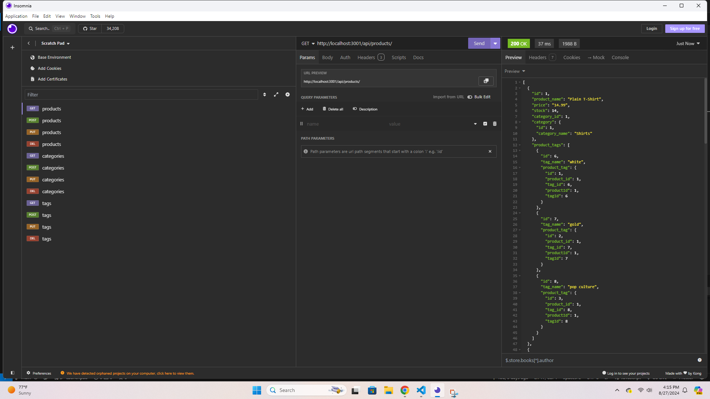
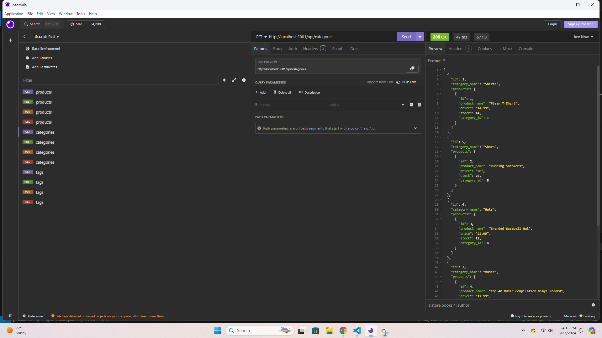
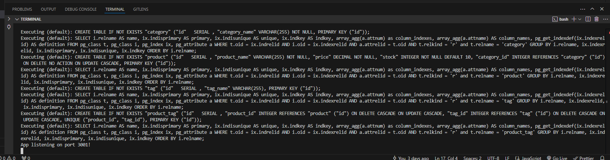

# E-Commerce Back End

## Description
This is the back end to an E-commerce site that sells products. It's designed for managers at an internet retail company, so they can keep inventory and organize their stock. The back end contains products, categories, and tags. It uses the categories and tags to label and organize the products. Using this back end you can add, view, update, or delete any of these.

## Usage
Use the contained schema.sql to get the database, and run "npm run seed" to seed the data. Then run "npm start" to start the server. Using insomnia and the contained routes, you can make requests depending on what you want to do. GET, POST, PUT, and DELETE routes are available for products, categories, and tags. You can either use GET for all of them or just one by ID. 

## Technologies
- Node.js
- Express
- Sequelize
- PostgreSQL

## Screenshots

## Links
- https://github.com/ckisi/e-commerce-back-end
- Video: https://drive.google.com/file/d/1Navasosmt0dMBlklQN4JbYiZ5Hco0lUf/view

## Credits
Xpert Learning Assistant
